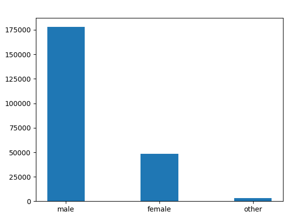
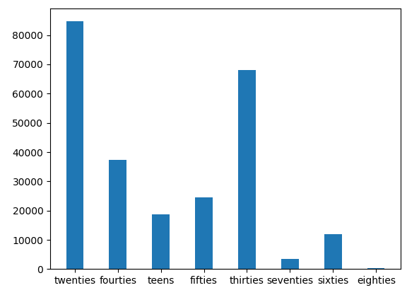
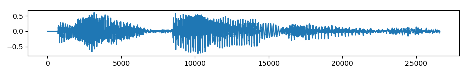
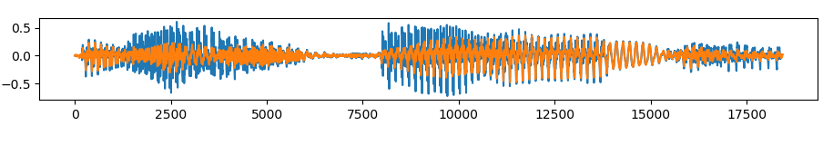
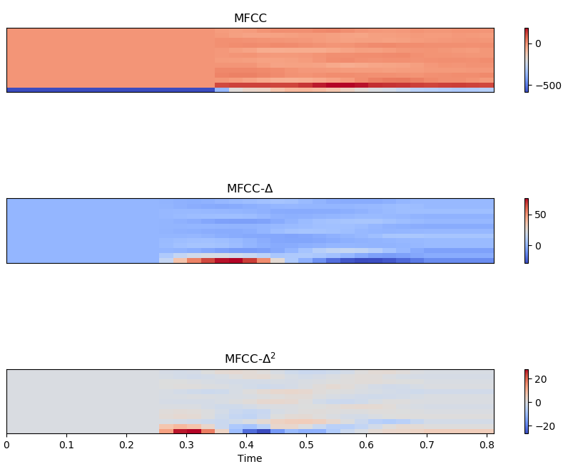
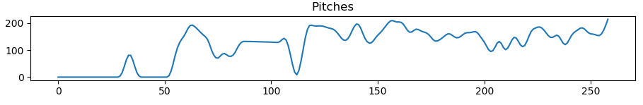
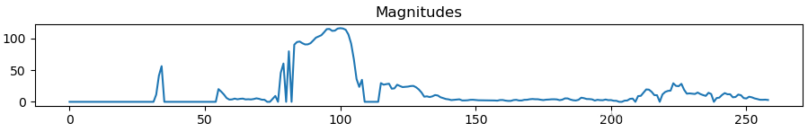
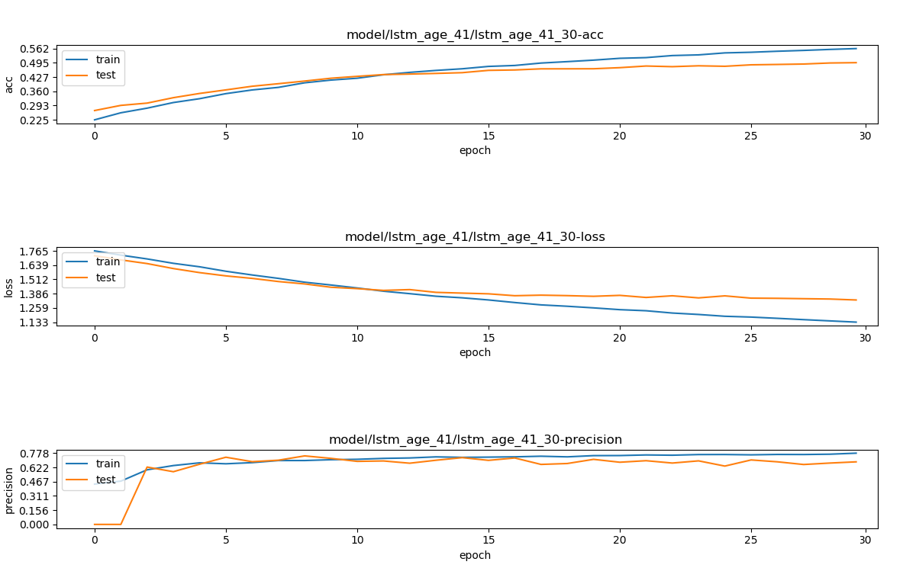

# Voice-Based Gender and Age Recognition Using Deep Learning

A deep learning-powered system that predicts gender and age group based on audio recordings. This project leverages LSTM neural networks to analyze voice features and classify speaker characteristics with real-time capability.

---

## Features

- Gender classification from voice
- Age group prediction (teens to sixties)
- Real-time voice processing using PyAudio
- Visual performance tracking using accuracy and loss metrics

---

## Dataset

**Source:** Mozilla Common Voice Dataset (English subset)

- **Gender Data:** 230,000 samples → filtered to adults (age > 20) → 97,000 balanced samples (male/female)
- **Age Data:** 250,000 samples → filtered to speakers below 70 → 71,000 samples divided into 6 age groups: teens, twenties, thirties, forties, fifties, sixties

**Visualizations:**

- Initial gender dataset:  
  

- Initial age dataset:  
  

**Preprocessing Highlights:**

- For gender, included only adult voices (age > 20)
- For age, included samples from people aged below 70
- Final Training Sets:
  - 97,000 samples for gender (male and female)
  - 71,000 samples for age (6 age groups)

---

## Audio Preprocessing

- **Sample Rate:** 44.1kHz
- **Mono Conversion**
- **Silence Removal:**
  - Global silence threshold ≤ 18dB
  - Start/end trimming ≤ 10dB
- **Noise Filtering**
- **Harmonic and Percussive Preservation**

**Steps:**
1. **Global Threshold:** Remove silence where volume ≤ 18dB  
   

2. **Trim Edges:** Remove silence from start and end where volume ≤ 10dB  
   

---

## Feature Extraction

Each audio clip is converted into a 41-dimensional feature vector using Librosa:

- 13 MFCCs
- 13 Delta-MFCCs
- 13 Delta²-MFCCs
- 1 Pitch Estimate (Hann window smoothing)
- 1 Magnitude Value (Hann window smoothing)

**Visuals:**
- MFCCs and derivatives:  
  

- Pitch values:  
  

- Magnitude values:  
  

---

## Model Architecture

### 1. Gender Classification

- Architecture: 2 LSTM layers (100 units)
- Dropout: 30% and 20%
- Output: Softmax (2 classes)
- Loss: Categorical Crossentropy
- Optimizer: ADAM
- Epochs: 10
- Validation Accuracy: 93%
- Precision: 0.94

### 2. Age Classification

- Architecture: 2 LSTM layers (256 units) → Fully Connected (ReLU)
- Dropout: 30%
- Output: Softmax (6 classes)
- Loss: Categorical Crossentropy
- Optimizer: ADAM
- Epochs: 30
- Validation Accuracy: 49%
- Precision: 0.68

**Age Model Performance Chart:**  

---

## Model Evaluation

- Train-validation split: 80-20
- Input features: normalized (zero mean, unit variance)
- Batch size: 128 (mini-batch training)

---

## Inference and Real-time Deployment

Real-time classification is implemented using PyAudio. After capturing voice, the pipeline performs preprocessing and classification with minimal latency.

---

## Author

**Pradip Giri**  
Master’s Student, Algoma University  
[Connect on LinkedIn](#)

---

## Note

This project is intended for research and educational purposes. Accuracy may vary based on dataset diversity, recording quality, and environmental conditions.
